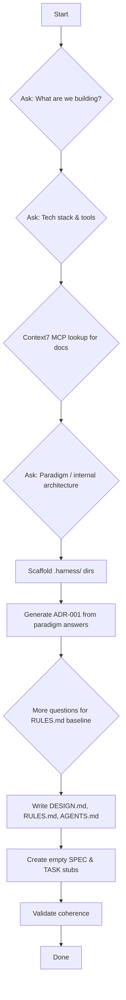

# Harness Init

Bootstrap the full Harness governance layer for a new or empty repository. The skill follows a strict progression: ask → research (optional Context7) → scaffold → validate.

---

## Flow Overview



## Step 0 — Detect Existing Project

Before asking questions, scan the repository to determine if it already has a codebase. This enables **scan-driven mode** for existing projects instead of full interactive questioning.

### Detection Strategy

Look for any language/runtime configuration file:

| File Pattern | Indicates |
|---|---|
| `package.json`, `yarn.lock`, `pnpm-lock.yaml` | Node.js/TypeScript/JavaScript project |
| `Cargo.toml`, `Cargo.lock` | Rust project |
| `requirements.txt`, `pyproject.toml`, `Pipfile`, `poetry.lock` | Python project |
| `go.mod`, `go.sum` | Go project |
| `Gemfile`, `gemspec`, `Rakefile` | Ruby project |
| `pom.xml`, `build.gradle*`, `settings.gradle` | Java/Kotlin/Spring project |
| `composer.json`, `vendor/` | PHP project |
| `CMakeLists.txt`, `meson.build` | C/C++ project |
| Any directory with `.rs`, `.py`, `.go`, `.ts`, `.js`, `.java` files in non-test root dirs | Source code present |

### Scan Results → Mode Decision

**A) Project has existing source code and/or package manifests:**
- Tech stack is **auto-detected** from scan results (skip asking)
- Run ADR-001 generation for paradigm architecture only (ask the user to confirm or provide their preference if detection is ambiguous)
- Proceed with Steps 5–11 using detected tech stack

**B) Project has `.harness/` directory already populated:**
- Harness is **already initialized** — report this and ask if user wants a full audit instead (suggest `harness-doctor` skill), or proceed to update only.
- Do NOT re-generate files; surface existing content for review first

**C) Repository is empty or has no source/package config:**
- Treat as **new project** → fall through to Steps 1–11 with full interactive questioning

## Step 1 — Project Purpose

**Adapt based on scan result (Step 0):**

- **If project is new/empty:** Ask the user:

> What is this project going to be? Give a description of what you're building.

- **If project has existing source code:** Skip this question. Extract purpose from reading `README.md`, `docs/` directory, or repository commit history (last meaningful commits). If nothing conclusive can be extracted after 2–3 attempts, fall back to asking the user directly.

Capture the answer as the **project purpose**. This becomes the foundation of `DESIGN.md`.

Use it verbatim or lightly refined as the opening "Purpose" section in DESIGN.md. Never invent details — only use what the user provides.

## Step 2 — Technology Stack & Tools

**Adapt based on scan result (Step 0):**

- **If project is new/empty:** Ask the user:

> Which language, runtime, framework or technologies are involved? For example: Node 24, native TypeScript support, no building, Fastify, MongoDB, Redis, Handlebars.

Capture every technology mention. Then use Context7 MCP to enrich understanding of each technology (only when configured — see "Context7 Integration" below).

- **If project has existing source code:** Detect from manifest files found in Step 0:

| Detected File | Extract From |
|---|---|
| `package.json` | `engines.node`, `dependencies`, `devDependencies`, `scripts` |
| `Cargo.toml` | `[package] name, version; [dependencies.*] version |
| `requirements.txt` / `pyproject.toml` | Direct dependencies and versions |
| `go.mod` | Module path, imported packages (`require`) |

Do not ask the user. Use detected tech stack as-is. If any critical runtime info is ambiguous (e.g., missing version in manifest), ask one targeted question instead of the full Stack question.

## Step 3 — Context7 MCP Technology Lookup *(Optional)*

Only run this step if a technology stack was declared or detected (i.e., not empty). If no technologies are present, skip entirely.

If `mcp-server-context7` is available in the current environment, call it for **each declared/detected technology** with focused queries like:

- `"project setup conventions"`
- `"directory structure best practices"`
- `"architecture patterns recommended"`
- `"dependency configuration standard location"`

This feeds directly into ADR generation and RULES.md constraints. If MCP is not configured or fails, gracefully skip and continue without enrichment — don't block on it.

---

## Step 4 — Paradigm & Internal Architecture

Present the user with **architectural paradigm options** and ask them to pick one (or describe their own):

```
Choose your preferred internal architecture:

A) OOP + Entity-based directory    → classes, models, controllers organized by domain/entity
B) Functional Core / IO Boundary   → pure core logic separated from side-effecting I/O ports
C) Reactive programming            → async-first, streams, event-driven data flow
D) Layered monolith               → clearly separated layers (presentation → service → repository)
E) Other — describe your preference
```

Based on the answer, generate **ADR-001** (`adr/001-[name]-architecture-decision.md`) covering:

- Decision context (what we're building + paradigm chosen)
- Architectural options considered
- Why this paradigm was selected (references to technology documentation when available from Context7)
- Consequences (pros / cons / trade-offs)
- References (linked technologies)

Naming convention for ADR files: `001-[name]-architecture-decision.md` where `[name]` is a kebab-case summary like `frontend-backsplit-architecture`.

---

## Step 5 — Scaffold `.harness/` Directories

Create the following empty directories (only if they don't already exist):

```
.harness/
├── ADR/           ← Architecture Decision Records
├── SPEC/          ← Feature specification documents
└── TASKS/         ← Task files with cross-references to specs and ADRs
```

Naming convention for tasks: `002-[name]-task.md` (e.g., `002-implement-user-auth-task.md`). Files in `.harness/TASKS/`. Cross-reference format uses markdown links like `[ADR-001](./../adr/001-architecture-decision.md)`.

---

## Step 6 — Generate DESIGN.md

Create `.harness/DESIGN.md` with these sections (filled from answers):

```markdown
# Design Document

## Purpose
[Project description verbatim]

## Technology Stack
| Category | Details |
|----------|---------|
| Language | ... |
| Runtime | ... |
| Frameworks | ... |
| Data Stores | ... |
| Tools/Utils | ... |

## Architecture Overview
[Brief summary derived from ADR-001 and paradigm choice]

## UI / UX Considerations (if applicable)
[Describe intended UI behavior, layout expectations, user flows — or note "N/A"]
```

---

## Step 7 — Generate RULES.md

Create `.harness/RULES.md` with a baseline "do" list and "don't" list. Include at least:

**DO:**
- Follow the architectural paradigm defined in ADR-001
- Reference decisions via `[ADR-N](./../adr/001-...).md)` markdown links
- Create SPEC documents before writing TASK files
- Update the corresponding TASK file after completing each step (add `- [x]` checkbox)

**DON'T:**
- Skip architectural steps or implement without an ADR for significant decisions
- Duplicate information across files — keep one source of truth per concern
- Commit to main branch directly; always work via a feature branch following the paradigm's conventions
- Write code without a matching SPEC document unless trivial (e.g., configuration changes)

Extend with technology-specific rules from Context7 lookups when available.

---

## Step 8 — Generate AGENTS.md

Create root `AGENTS.md` as the **entrypoint map** for AI sessions:

```markdown
# Agent Instructions — <Project Name>

## Overview
[One-sentence project summary]

## How This Repo Works
This repo uses a Harness governance system. All development follows these conventions.

## Navigation Map
| Concern | File / Directory | Description |
|---------|-----------------|-------------|
| Project purpose & UI | `.harness/DESIGN.md` | What we're building, tech stack, architecture overview |
| Architectural decisions | `.harness/ADR/*.md` | ADRs referenced via `# Decision Records` section below |
| Feature specs | `.harness/SPEC/*.md` | Spec documents that define what to build |
| Active tasks | `.harness/TASKS/` | Task files with checkboxes, cross-referencing ADRs and specs |
| Conventions & must/don't rules | `.harness/RULES.md` | Hard constraints on how we build this project |

## Workflow Directives

### When you finish a task step:
1. Update the corresponding TASK file — check off completed items (`- [ ]` → `- [x]`)
2. If the step introduced a new architectural directive or design aspect, update `DESIGN.md` and/or `RULES.md` accordingly

### When creating a new feature:
1. Read `RULES.md` first
2. Create a SPEC document in `.harness/SPEC/` if one doesn't exist
3. Create the TASK file following naming convention (`002-...task.md`)
4. Cross-reference relevant ADRs using markdown links

### When you encounter an architecture question:
1. Check existing `ADR/` files first
2. If no matching ADR exists and the decision is significant, create a new one in `.harness/ADR/`
3. Update AGENTS.md table if the decision changes how work flows

## Conventions
[Copy relevant items from RULES.md as bullet points]
```

---

## Step 9 — More Questions for Rules Baseline (Curated List)

Ask the user these questions to fill in additional RULES.md entries. Use a curated list — present them clearly:

> A few more baseline rules would help future AI sessions stay aligned:

1. **Error handling** — Do we use try/catch everywhere, or only at boundaries? Any pattern library (e.g., `Result<T,E>`)?
2. **Testing strategy** — Unit tests mandatory? Integration tests? Which framework (Jest, Vitest, Pytest, etc.)?
3. **Branching / commit conventions** — Conventional Commits? Feature branches? Trunk-based?
4. **Dependency management** — Lockfile strategy, update frequency rules, approved package list?
5. **Logging & observability** — Structured logging? Which library (pino, winston, structured-logs)?
6. **Code review requirements** — Minimum reviewers? PR description template required?

Let the user answer what matters; accept "skip" or leave as a placeholder with `[TODO: confirm]`.

---

## Step 10 — Validation

After all files are created, run these validation checks and report any issues to the user. Do **not** make automatic fixes — only surface problems.

### Directory Check
- `.harness/ADR/` exists ✓
- `.harness/SPEC/` exists ✓
- `.harness/TASKS/` exists ✓

### File Coherence Check
| File | Must contain | Status |
|------|-------------|--------|
| `ADR/001-*.md` | Decision context, options considered, rationale, consequences, references section | Verify |
| `.harness/DESIGN.md` | Purpose, tech stack table, architecture overview | Verify |
| `.harness/RULES.md` | DO list and DON'T list (both non-empty) | Verify |
| `AGENTS.md` | Navigation map table with all harness files listed, workflow directives section | Verify |

### Cross-Reference Check
- ADR-001 is referenced in RULES.md via markdown link format `[ADR-001](./../adr/...).md` ✓
- AGENTS.md lists all `.harness/` files and `AGENTS.md` itself | Verify |
- No broken paths or missing file references | Check |

### File Path Consistency
Verify all referenced paths in generated files resolve correctly from their containing file's directory context. Relative links should be correct regardless of which harness subdirectory the reference originates from.

---

## Step 11 — Summary Report

Present to the user:

```
✅ Harness initialized successfully!

Project: <name/purpose>
Tech stack: <summary>
Paradigm: <paradigm chosen>

Created files:
- .harness/ADR/001-[name]-architecture-decision.md
- .harness/DESIGN.md
- .harness/RULES.md
- AGENTS.md
- .harness/SPEC/ (empty — ready for feature specs)
- .harness/TASKS/ (empty — ready for task files)

Next steps:
1. Open AGENTS.md to understand the workflow map
2. When starting a new feature, create a SPEC document first
3. Answer remaining baseline questions to strengthen RULES.md
```

---

## Context7 MCP Notes

This skill optionally uses `mcp-server-context7` for technology documentation lookup. Behavior:

- Called only in Step 3 if the MCP tool is available in the environment
- Queries are per-technology, focused on architecture patterns and conventions
- Failures are non-blocking — proceed with user-provided info
- Documentation content should NOT be hardcoded; always look up current state at init time

If Context7 is not configured or unavailable: skip enrichment and note this in the summary report. The harness scaffold will still be valid without external documentation references.

---

## Constraints

- **Never create files the user hasn't approved** — each major file (ADR, DESIGN.md, RULES.md, AGENTS.md) should be shown before writing unless it's a simple structural dir creation
- **Never hardcode technology details** — always use what the user specified or Context7 lookups
- **Always generate ADRs with full structure** — no placeholder-only ADRs; every required section must have content
- **Use relative paths consistently** — cross-references from TASK files to ADR/SPEC should work when opened directly in any editor
- **Keep RULES.md baseline-enough** — it should provide clear do/don't guardrails without being overly prescriptive for a new project
